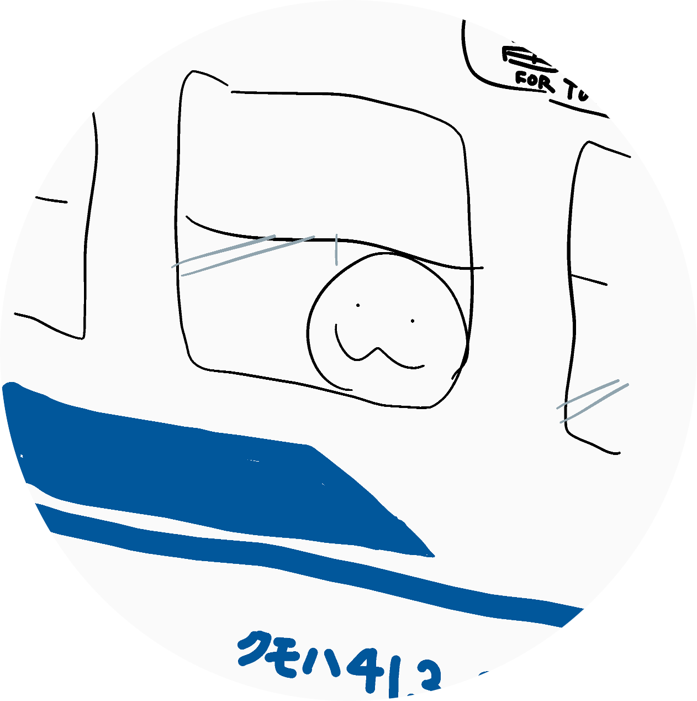

# ☆概要☆
Bve5/6上で動作する路線・車両データを公開しています。  
  
# ☆自己紹介☆  
  
名前:△12△(三角印12番)  
住処:近畿  
年齢:㊙  
趣味:Bve、撮り鉄、乗り鉄(18きっぷ旅)、録り鉄  
好きなもの:国鉄型電車・気動車・機関車  
嫌いなもの:梅雨、眼鏡の曇り  
一言:Bve制作は楽しいぞ。岡山はいいぞ。  
  
# ☆制作中☆  
> 路線:  
> - JR山陽線  
> - JR札沼線もどき

> 車両:  
> - 103系  
> - 113系  
> - 115系  
> - 201系  
> - 521系  
> - 阪急3000系

# ☆参加中☆  
> - 東海道・山陽新幹線プロジェクト  
> - 山陽本線プロジェクト  
> - せとうちBVE作者の会  

# ☆リンク☆  
[ホームページ](http://sankakujirusi12.ninja-web.net/)←鉄道写真、Bveの素材など  
<!---[進捗ノート](https://shinchoku.net/users/sankakujirusi12)←ときどきまとめて進捗上げてます  
--->
進捗ノートとTwitterアカウントの運用は終了しました。  
<!---
sankakujirusi12/sankakujirusi12 is a ✨ special ✨ repository because its `README.md` (this file) appears on your GitHub profile.
You can click the Preview link to take a look at your changes.
--->
